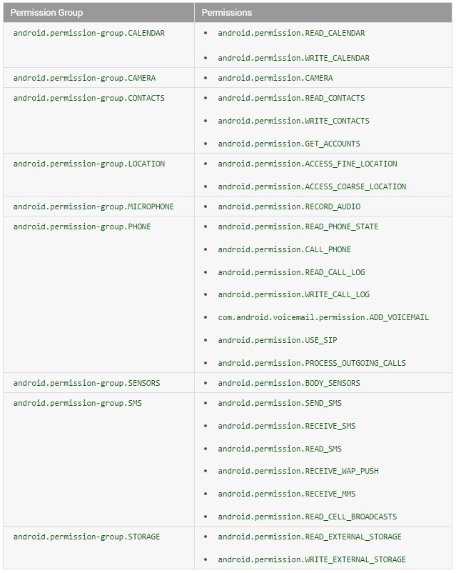

Android6.0之后将权限分为了两类：普通和危险权限，普通权限和危险权限都需要在AndroidManifest文件中声明，同时还引入了权限组的概念。

## 权限组

Android将同类型的权限分为一组，如下图中location组权限中包含：ACCESS_FINE_LOCATION和ACCESS_COARSE_LOCATION这两个权限，当同一组中的某一个权限被授权，其他权限也一并被授权。



## 重要API
新的权限Api主要有三个重要方法：
- 检查权限方法
```java
//用于检查某个权限是否得到授权
public static int checkSelfPermission(@NonNull Context context, @NonNull String permission);
```
该方法返回'PERMISSION_GRANTED'或'PERMISSION_DENIED'分别表示接受和拒绝，但是，当用户拒绝并且点击不再询问时，这个方法始终返回'PERMISSION_GRANTED，此时我们就需要利用第三个方法'shouldShowRequestPermissionRationale'了。
- 请求权限
```java
public static void requestPermissions(final @NonNull Activity activity, final @NonNull String[] permissions, final @IntRange(from = 0) int requestCode)
```
此方法可以同时申请一组权限。
- 判断是否选择不再询问
```java
//用于检查某个权限申请是够被设为不再询问，face表示你可以展示权限申请提示，true表示否
public static boolean shouldShowRequestPermissionRationale(@NonNull Activity activity, @NonNull String permission)
```
这个API主要用于给用户一个申请权限的解释，该方法只有在用户在上一次已经拒绝过你的这个权限申请。也就是说，用户已经拒绝一次了，你又弹个授权框，你需要给用户一个解释，为什么要授权，则使用该方法。
除了上面三个API方法外，还有一个需要我们注意，那就是回调方法（一般在Activity和fragment中）。
```java
//requestCode同requestPermissions中一样，主要用来标识权限请求
//permissions 对应的相关权限
//grantResults 里面存放表示同意还是拒绝的结果值
public void onRequestPermissionsResult(int requestCode, @NonNull String[] permissions,@NonNull int[] grantResults)
```
**这里需要注意一点：你使用fragment发起的请求只能在fragment中监听，同理Activity。**
## 不在询问
关于不在询问的情况处理分为两种，为啥分为两种呢？主要是为了匹配第三方rom（坚果pro、小米系列等）。官方rom中是否设置为不再询问，我们可以通过`shouldShowRequestPermissionRationale()`方法来判断。但第三方rom由于定制原因不能通过该方法进行判断，在第三方rom中该方法一直返回false，观察了很多app的做法是直接给出提示。
## DEMO
在最后我们来一个常规的demo：
```java
public class PermissionUtils {

    public static void requestPermission(Object obj, String[] args, int requestCode) {
        List<String> permissions = denyFilterPermission(getActivity(obj), args);
        if (permissions.size() > 0) {
            String[] per = permissions.toArray(new String[permissions.size()]);
            if (obj instanceof Activity) {
                ((Activity) obj).requestPermissions(per, requestCode);
            } else if (obj instanceof Fragment) {
                ((Fragment) obj).requestPermissions(per, requestCode);
            } else {
                throw new IllegalArgumentException(obj.getClass().getName() + " is not supported");
            }
        }
    }

    public static Activity getActivity(Object obj) {
        if (obj instanceof Activity) {
            return (Activity) obj;
        } else if (obj instanceof Fragment) {
            return ((Fragment) obj).getActivity();
        }
        return null;
    }
    
    public static List<String> denyFilterPermission(Activity activity, String... permission) {
        List<String> pem = new ArrayList<>();
        for (String p : permission) {
            if (ActivityCompat.checkSelfPermission(activity, p) != PackageManager.PERMISSION_GRANTED) {
                pem.add(p);
            }
        }
        return pem;
    }
}
```
我们先写一个工具类用于权限的请求。
在Activity中我们定义了一个textview并设置了一个点击事件，当点击这个rextview的时候我们就检测是否被授权，在回调中我们处理相应的操作：
```java
public class MainActivity extends AppCompatActivity implements View.OnClickListener {
    private TextView tv;
    private final int reCode = 0x11;

    @Override
    protected void onCreate(Bundle savedInstanceState) {
        super.onCreate(savedInstanceState);
        setContentView(R.layout.activity_main);
        tv = (TextView) this.findViewById(R.id.test);
        tv.setOnClickListener(this);
    }

    @Override
    public void onClick(View view) {
        PermissionUtils.requestPermission(this, new String[]{Manifest.permission.ACCESS_FINE_LOCATION
        ,Manifest.permission.ACCESS_COARSE_LOCATION}, reCode);
    }

    @Override
    public void onRequestPermissionsResult(int requestCode, @NonNull String[] permissions, @NonNull int[] grantResults) {
        switch (requestCode) {
            case reCode:
                boolean canDo = true;
                for (int i = 0; i < grantResults.length; i++) {
                    if (grantResults[i]== PackageManager.PERMISSION_DENIED){
                        canDo = false;
                        //如果用户勾选了不再询问，我们将引导用户去设置开启权限
                        if (!ActivityCompat.shouldShowRequestPermissionRationale(this,permissions[i])) {
                            Intent intent = new Intent(Settings.ACTION_APPLICATION_DETAILS_SETTINGS);
                            Uri uri = Uri.fromParts("package", getApplicationContext().getPackageName(), null);
                            intent.setData(uri);
                            startActivity(intent);
                        }
                        break;
                    }
                }
                break;
        }
        super.onRequestPermissionsResult(requestCode, permissions, grantResults);
    }
}
```

## 总结
- 使用中应当注意targetSdkVersion的配置，如果希望在项目中启用新的权限验证，需将target版本设置大于或等于23版本。
- 为了兼容低版本可以使用兼容包里的Api

### 参考
[ Android 6.0 运行时权限处理完全解析-鸿阳](http://blog.csdn.net/lmj623565791/article/details/50709663)
[Android M 新的运行时权限开发者需要知道的一切](http://www.jcodecraeer.com/a/anzhuokaifa/androidkaifa/2015/0830/3387.html)
[Android 6.0运行时权限用户选择“不在提示”的处理 - 三点一四        - CSDN博客](http://blog.csdn.net/u012719153/article/details/66132337)
[Appops权限管理 - CSDN博客](http://blog.csdn.net/liu1314you/article/details/52057669)

开源框架
[GitHub - permissions-dispatcher](https://github.com/permissions-dispatcher/PermissionsDispatcher)