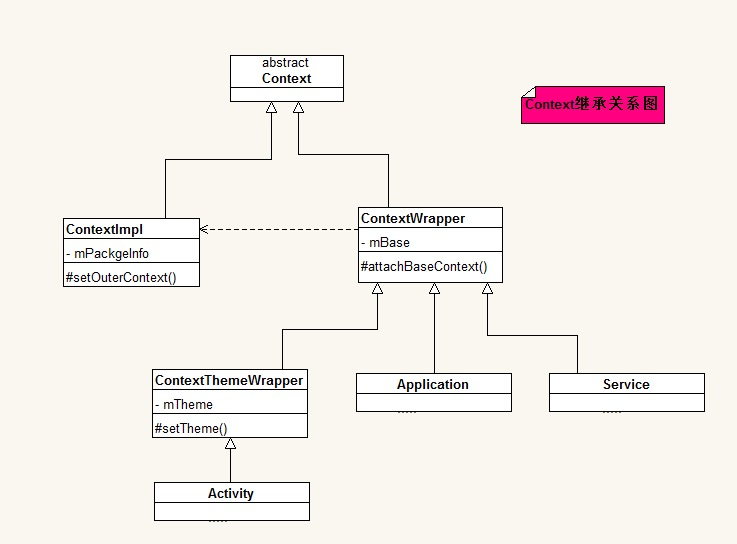

## 谈谈你对Application类的理解

首先，Application在一个Dalvik虚拟机里面只会存在一个实例。

### 那么为什么强调说是一个Dalvik虚拟机，而不是说一个App呢？

因为一个App有可能有多个Dalvik虚拟机，也就是传说中的多进程模式。在这种模式下，每一个Dalvik都会存在一个Application实例，他们之间没有关系，在A进程Application里面保存的数据不能在B进程的Application获取，因为他们根本不是一个对象，而且被隔离在了两个进程里面，所以这里强调是一个Dalvik虚拟机，而不是一个App。

其次，Application的实质是一个Context，它继承自ContextWrapper。

```shell
	android.content.Context
 	   ↳	android.content.ContextWrapper
 	   	↳	android.app.Application	 
```

ContextWrapper是什么玩意？就是对Context的一个包装而已。

Application有两个子类，一个是MultiDexApplication，如果你遇到了"65535"问题，可以选择继承自他，完成多Dex打包配置的相关工作。

另外一个是在TDD(测试用例驱动)开发模式中使用Moke进行测试的时候用到的，可以来代替Application的Moke类MockApplication。

在应用启动的时候，会首先调用Application.attach()，当然，这个方法是隐藏的，开发者能接触到的第一个被调用的方法其实是Application.onCreate()，我们通常会在这个方法里面完成各种初始化，比如图片加载库、Http请求库的默认配置初始化操作等等。但是最好别在这个方法里面进行太多耗时操作，因为这会影响App的启动速度，所以对于不必要的操作可以使用异步操作、懒加载、延时加载等策略来减少对UI线程的影响。

### Activity.getApplication()、Service.getApplication()与getApplicationContext()的区别？



可以肯定的是这三个方法所得到的Application对象都是同一个对象，但是

除此之外，由于在Context中可以通过getApplicationContext()获取到Application对象，或者是通过Activity.getApplication()、Service.getApplication()获取到Application，所以可以在Application保存全局的数据，供所有的Activity或者是Service使用。

PS：使用上面的三种方法获取到的都是同一个Application对象，getApplicationContext()是在Context的实现类ContextImpl中具体实现的，而getApplication()则是在Activity和Service中单独实现的，所以他们的作用域不同，但是获取到的都是同一个Application对象，因为一个Dalvik虚拟机只有一个Application对象。

但是这里存在着一个坑，那就是在低内存情况下，Application有可能被销毁，从而导致保存在Application里面的数据信息丢失，最后程序错乱，甚至是Crash。

所以当你想在Application保存数据的时候，请做好为空判断，或者是选择其他方式保存你的数据信息。

另外，在Application中存在着几个有用的方法，比如onLowMemory()和onTrimMemory()，在这两个方法里面，我们可以实现自己的内存回收逻辑，比如关闭数据库连接、移除图片内存缓存等操作来降低内存消耗，从而降低被系统回收的风险。

最后，就是要注意Application的生命周期，他和Dalvik虚拟机生命周期一样长，所以在进行单例或者是静态变量的初始化操作时，一定要用Application作为Context进行初始化，否则会造成内存泄露的发生。使用Dialog的时候一般使用Activity作为Context，但是也可以使用Application作为上下文，前提是你必须设置Window类型为TYPE_SYSTEM_DIALOG，并且申请相关权限。这个时候弹出的Dialog是属于整个Application的，弹出这个Dialog的Activity销毁时也不会回收Dialog，只有在Application销毁时，这个Dialog才会自动消失。

## 参考资料

- [不要在Android的Application对象中缓存数据!](http://zmywly8866.github.io/2014/12/26/android-do-not-store-data-in-the-application-object.html)
- [Android Context 是什么？](http://blog.csdn.net/feiduclear_up/article/details/47356289)