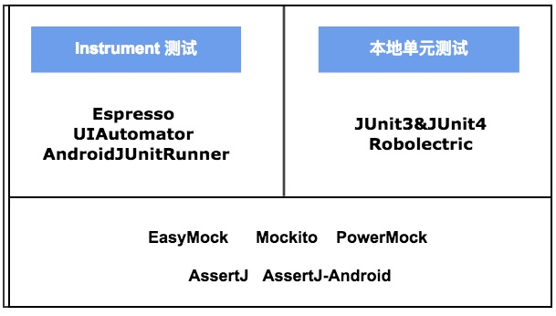
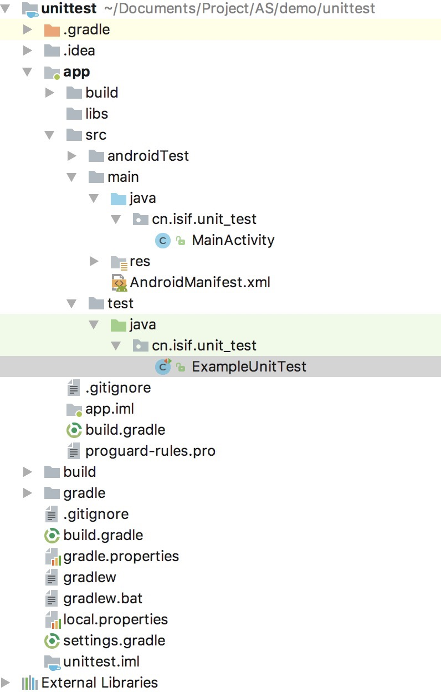

单元测试在我们国内使用应该比较少，但是作为学习和研究还是值得的，这里我总结一下最近研究和学习，旨在用时便于参考，本文重在体验学习，所以并没有大块的代码示例。

Android 单元测试分为可以分为两块，一块是针对java方法，另一块是针对Android环境的（比如是UI、组件等），这两块各自对应不同的库，下图是用于单元测试的各种库，从测试环境上也是两块即Instrument测试和本地单元测试，Android studio自带的是junit4和espresso，图下面那些控件是用来mock对象等。



## Java单元测试

说起java的单元测试工具最好莫过于junit没有之一，当然我们的ide工具自动为我们集成了这个工具，这大大方便了我们使用，junit使用非常简单，在创建的Android工程中我们可以找到test目录（与app工程目录main同级），这就是junit目录了，我们的java单元测试就在这里写，下面我们结合着一个案例的理解。

1、首先我们引用一下junit库，在app模块下的build.gradle文件中添加：
```
testCompile 'junit:junit:4.12'
```
先看一下我们的项目结构：




2、我们在main/java/cn.isif.unit-test/下创建一个HelloTest类:
```java
package cn.isif.unit_test;

public class HelloTest {
    public int sum(int a, int b) {
        return a + b;
    }
}
```
3、然后右键goto->test->new create test然后选择需要测试的方法，目标目录一定要选择test而不是androidTest:
```java
package cn.isif.unit_test;

import org.junit.Test;
import static org.junit.Assert.*;

public class HelloTestTest {
    @Test
    public void sum() throws Exception {
        //创建一个HelloTest实例
        HelloTest helloTest = new HelloTest();
        int result = helloTest.sum(1,3);
        //断言，第一个是参数是期望值，第二个参数是待验证的值
        assertEquals(4,result);

    }
}
```
4、然后右键选择run HelloTestTest  即可。

**关于第3点中的目录为什么我们选择test而不是androidTest，这是因为我们在引入库的时候使用的是testCompile，当然我们也可以使用androidTestCompile，其对应的目录就是androidTest，但是因为junit是正对java方法的单元测试与Android环境无关所以我们最好使用testCompile，这是也为什么我们在创建项目的时候会生出两个测试目录。**
## Android单元测试
Android环境的单元测试相对于java的单元测试使用要复杂一些，这是因为Android程序是运行在Android虚拟机上的，但是也可直接运行在jvm上，这里我们主要介绍espresso的用法，其他用法参考官方文档。

[内容参考](https://developer.android.com/training/testing/espresso/index.html)

# 参考
[Android测试驱动开发(TDD) | Desmond’s Blog](http://blog.desmondyao.com/android-test/)
