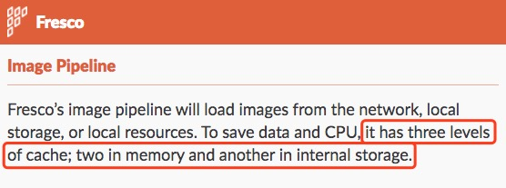
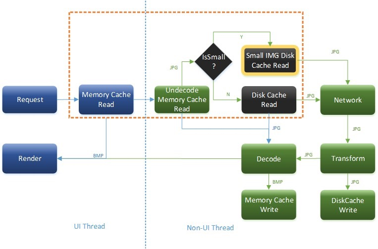

> 这个问题是别人问我的，他说在面试中有面试官问图片的三级缓存是指的哪三级缓存？因为不能及时作答他我就上网查了一下，网上大部分的答案都是：内存->磁盘->网络，困惑我的是为什么有网络，缓存的目的不就是减少网络请求次数吗？带着困惑继续查，然后就有了这篇文章  

## 内存->磁盘->网络
> 实现图片缓存也不难，需要有相应的cache策略。这里我采用 内存-文件-网络 三层cache机制，其中内存缓存包括强引用缓存和软引用缓存（SoftReference），其实网络不算cache，这里姑且也把它划到缓存的层次结构中。—— 任玉刚  

根据[android中图片的三级cache策略（内存、文件、网络） 一 - 任玉刚        - CSDN博客](http://blog.csdn.net/singwhatiwanna/article/details/9054001)一文(谣传这是图片三级缓存最早提出的:>)，作者将图片缓存分为了三个级别，一级是内存缓存，二级是磁盘缓存（也叫文件缓存），三级是网络缓存，图片读取缓存的策略是：内存->磁盘->网络。

## Fresco 缓存机制

上图是截至Fresco官方，Fresco提供三级缓存，两级内存和一级磁盘，下面对三种分别解释：
* Bitmap缓存
这是也常规的图片内存缓存方式，Bitmap对象是已经经过解码之后的图片对象，直接缓存Bitmap对象可以提高图片的加载速度。
在Android5.0系统以下，Bitmap对象是存在ashmem(Anonymous Shared Memory)之中，Bitmap的创建和释放不会引发GC，GC的调用会导致App卡顿。
Android5.0以上，因为在5.0以上系统优化了内存的管理，所有Bitmap是直接存在heap堆中。
* 未解码图片内存缓存
什么是未解码的图片呢？就是原始压缩格式的图片（图片的二进制数据）。
* 文件缓存
这个不用过多的解释，它也是保存的是原始压缩格式的图片。
前两种缓存在App处于后台时会自动释放，而第三种不会（持久化存储），即使关闭手机也不会被清除。
具体流程如下：

## 参考
[android中图片的三级cache策略（内存、文件、网络） 一 - 任玉刚        - CSDN博客](http://blog.csdn.net/singwhatiwanna/article/details/9054001)
[Fresco的缓存机制 - CSDN博客](http://blog.csdn.net/lufqnuli/article/details/51645556)
[面试时，问哪些问题能试出一个 Android 应用开发者真正的水平？ - 知乎](https://www.zhihu.com/question/19765032/answer/28681546)
[Android系统匿名共享内存Ashmem（Anonymous Shared Memory）在进程间共享的原理分析 - CSDN博客](http://blog.csdn.net/luoshengyang/article/details/6666491)
