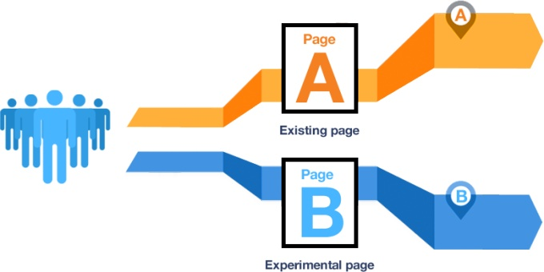
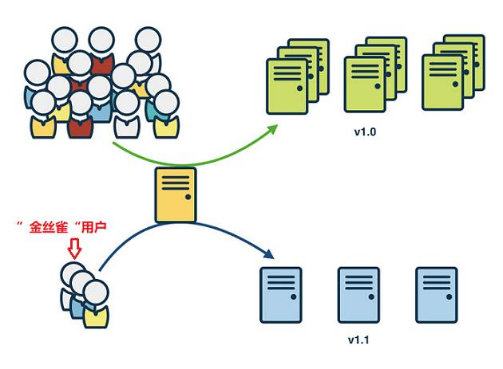

# A/B测试与灰度发布

**A/B测试**就是指把少部分用户分成平均的两组，其中一组用户体验网站改版的A版本，另外一组用户体验网站改版的B版本，分别记录清楚相关的所有用户操作数据以后再进行精确的比对，最后分析得出哪一个版本是用户最喜爱的。

**灰度发布**（又名为金丝雀发布）则是指在新的功能上线以及没有上线之间能够保证新的版本可以稳定过渡的一种发布方法，可以在灰度发布的过程当中解决一些问题或者对新版本做出一些可以提高用户体验的调整，这是保证网站可以平稳更新到新版本的有效过程。

## 参考
- [AB 测试最佳实践](https://zhuanlan.zhihu.com/p/26225333)
- [干货｜采用Istio实现灰度发布(金丝雀发布)](https://blog.csdn.net/hxpjava1/article/details/79509091)