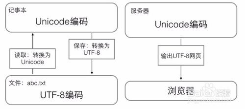
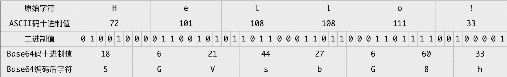
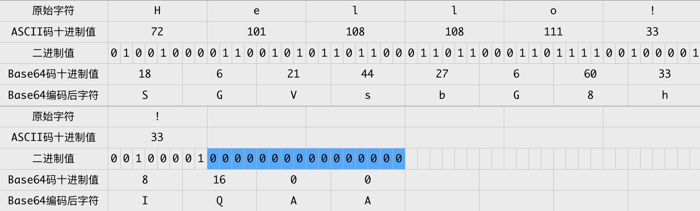

## Base64编码原理

Base64编码之所以称为Base64，是因为其使用64个字符来对任意数据进行编码，同理有Base32、Base16编码。标准Base64编码使用的64个字符为：

这64个字符是各种字符编码（比如ASCII编码）所使用字符的子集，基本，并且可打印。唯一有点特殊的是最后两个字符，因对最后两个字符的选择不同，Base64编码又有很多变种，比如Base64 URL编码。

Base64编码本质上是一种将二进制数据转成文本数据的方案。对于非二进制数据，是先将其转换成二进制形式，然后每连续6比特（2的6次方=64）计算其十进制值，根据该值在上面的索引表中找到对应的字符，最终得到一个文本字符串。

假设我们要对 Hello! 进行Base64编码，按照ASCII表，其转换过程如下图所示：

可知 Hello! 的Base64编码结果为 SGVsbG8h ，原始字符串长度为6个字符，编码后长度为8个字符，每3个原始字符经Base64编码成4个字符，编码前后长度比4/3，这个长度比很重要 - 比原始字符串长度短，则需要使用更大的编码字符集，这并不我们想要的；长度比越大，则需要传输越多的字符，传输时间越长。Base64应用广泛的原因是在字符集大小与长度比之间取得一个较好的平衡，适用于各种场景。

是不是觉得Base64编码原理很简单？

但这里需要注意一个点：Base64编码是每3个原始字符编码成4个字符，如果原始字符串长度不能被3整除，那怎么办？使用0值来补充原始字符串。

以 Hello!! 为例，其转换过程为：

注：图表中蓝色背景的二进制0值是额外补充的。

Hello!! Base64编码的结果为 SGVsbG8hIQAA 。最后2个零值只是为了Base64编码而补充的，在原始字符中并没有对应的字符，那么Base64编码结果中的最后两个字符 AA 实际不带有效信息，所以需要特殊处理，以免解码错误。

标准Base64编码通常用 = 字符来替换最后的 A，即编码结果为 SGVsbG8hIQ==。因为 = 字符并不在Base64编码索引表中，其意义在于结束符号，在Base64解码时遇到 = 时即可知道一个Base64编码字符串结束。

如果Base64编码字符串不会相互拼接再传输，那么最后的 = 也可以省略，解码时如果发现Base64编码字符串长度不能被4整除，则先补充 = 字符，再解码即可。

解码是对编码的逆向操作，但注意一点：对于最后的两个 = 字符，转换成两个 A 字符，再转成对应的两个6比特二进制0值，接着转成原始字符之前，需要将最后的两个6比特二进制0值丢弃，因为它们实际上不携带有效信息。