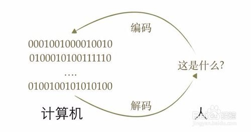
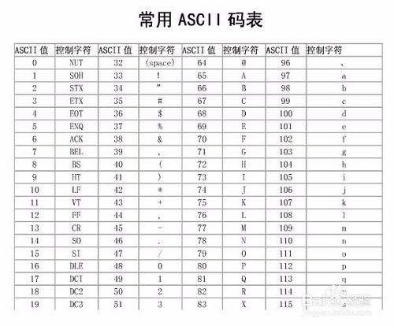

## 编码与解码
计算机中储存的信息都是用二进制数表示的；而我们在屏幕上看到的英文、汉字等字符是二进制数转换之后的结果。通俗的说，按照何种规则将字符存储在计算机中，如'a'用什么表示，称为"编码"；反之，将存储在计算机中的二进制数解析显示出来，称为"解码"，如同密码学中的加密和解密。在解码过程中，如果使用了错误的解码规则，则导致'a'解析成'b'或者乱码。

### 字符集（Charset）
是一个系统支持的所有抽象字符的集合。字符是各种文字和符号的总称，包括各国家文字、标点符号、图形符号、数字等。常用的字符集有：ASCII字符集、GB2312字符集、BIG5字符集、GB18030字符集、Unicode字符集等。如下图是ASCII的字符集：

### 字符编码（Character Encoding）
将字符集中符号转换为计算机可以接受的数字系统的数的过程。常见的编码方式有：Unicode、ASCII、GBK、GB2312、UTF-8等。如下图是“汉，字”所对应的Unicode和UTF-8的编码：

### Unicode介绍
由于计算机是美国人发明的，因此，最早只有127个字母被编码到计算机里，也就是大小写英文字母、数字和一些符号，这个编码表被称为ASCII编码，比如大写字母A的编码是65，小写字母z的编码是122。
但是要处理中文显然一个字节是不够的，至少需要两个字节，而且还不能和ASCII编码冲突，所以，中国制定了GB2312编码，用来把中文编进去。
你可以想得到的是，全世界有上百种语言，日本把日文编到Shift_JIS里，韩国把韩文编到Euc-kr里，各国有各国的标准，就会不可避免地出现冲突，结果就是，在多语言混合的文本中，显示出来会有乱码。

Unicode把所有语言都统一到一套编码里，这样就不会再有乱码问题了。
Unicode标准也在不断发展，但最常用的是用两个字节表示一个字符（如果要用到非常偏僻的字符，就需要4个字节）。现代操作系统和大多数编程语言都直接支持Unicode。

### Unicode与UTF-8
统一成Unicode编码，乱码问题从此消失了。但是，如果你写的文本基本上全部是英文的话，用Unicode编码比ASCII编码需要多一倍的存储空间，在存储和传输上就十分不划算。所以本着节约的精神，在存储和传输时，如果把Unicode中多余的信息压缩一下，就更完美了。UTF-8编码方式就是这其中的代表。从下图中可以看出，UTF-8编码有一个额外的好处，就是ASCII编码实际上可以被看成是UTF-8编码的一部分，所以，大量只支持ASCII编码的历史遗留软件可以在UTF-8编码下继续工作。

### 总结
总结一下现在计算机系统通用的字符编码工作方式（如下图）：
* 1.在计算机内存中，统一使用Unicode编码，当需要保存到硬盘或者需要传输的时候，就转换为UTF-8编码；
* 2.用记事本编辑的时候，从文件读取的UTF-8字符被转换为Unicode字符到内存里，编辑完成后，保存的时候再把Unicode转换为UTF-8保存到文件；
* 3.浏览网页的时候，服务器会把动态生成的Unicode内容转换为UTF-8再传输到浏览器。

