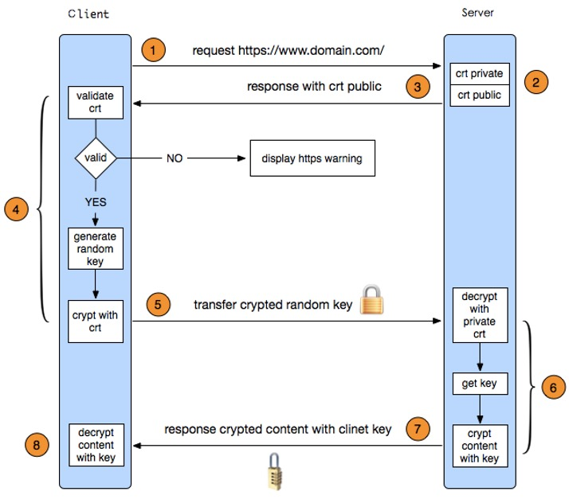

这里记录最近学习http以及https的一些知识。
首先，我们对http还算比较熟悉，在实际的开发中也是用的比较多的一种网络请求协议。但是我们知道http是以明文的方式传输数据的，这也就是说如果有人劫持我们的请求可以毫不费力的看到我们的信息，如果这是一些交易或者敏感的信息的话，这无疑是一个巨大的隐患。那么，在此背景下https诞生了，https的出去就是为了解决http明文传输的安全问题。
Https协议=Http协议+SSL/TLS协议，解释一下什么是SSL/TLS ，SSL的全称是Secure Socket Layer，即安全套接层协议，是为网络通信提供安全及数据完整性的一种安全协议。TLS的全称是Transport Layer Security，即安全传输层协议，TLS是IEF(Internet Engineering Task Force,Internet工程任务组)制定的一种新的协议，它建立在SSL3.0协议规范之上，是SSL3.0的后续版本。在TLS与SSL3.0之间存在着显著的差别，主要是它们所支持的加密算法不同，所以TLS与SSL3.0不能互相操作。我们可以把SSL和LTS看做是同一个协议。
Https为了兼顾安全和效率，同时使用了对称加密和非对称加密算法，采用对称加密对数据加密，非对称加密对密钥加密。

HTTPS在传输的过程中会涉及到三个密钥：
- 服务器端的公钥和私钥，用来进行非对称加密
- 客户端生成的随机密钥，用来进行对称加密
一个HTTPS请求实际上包含了两次HTTP传输，可以细分为8步。
- 1）客户端向服务器发起HTTPS请求，连接到服务器的443端口。
- 2）服务器端有一个密钥对，即公钥和私钥，是用来进行非对称加密使用的，服务器端保存着私钥，不能将其泄露，公钥可以发送给任何人。
- 3）服务器将自己的公钥发送给客户端。
- 4）客户端收到服务器端的公钥之后，会对公钥进行检查，验证其合法性，如果发现发现公钥有问题，那么HTTPS传输就无法继续。严格的说，这里应该是验证服务器发送的数字证书的合法性，关于客户端如何验证数字证书的合法性，下文会进行说明。如果公钥合格，那么客户端会生成一个随机值，这个随机值就是用于进行对称加密的密钥，我们将该密钥称之为client key，即客户端密钥，这样在概念上和服务器端的密钥容易进行区分。然后用服务器的公钥对客户端密钥进行非对称加密，这样客户端密钥就变成密文了，至此，HTTPS中的第一次HTTP请求结束。
- 5）客户端会发起HTTPS中的第二个HTTP请求，将加密之后的客户端密钥发送给服务器。
- 6）服务器接收到客户端发来的密文之后，会用自己的私钥对其进行非对称解密，解密之后的明文就是客户端密钥，然后用客户端密钥对数据进行对称加密，这样数据就变成了密文。
- 7）然后服务器将加密后的密文发送给客户端。
- 8）客户端收到服务器发送来的密文，用客户端密钥对其进行对称解密，得到服务器发送的数据。这样HTTPS中的第二个HTTP请求结束，整个HTTPS传输完成。

##数字证书
通过观察HTTPS的传输过程，我们知道，当服务器接收到客户端发来的请求时，会向客户端发送服务器自己的公钥，但是黑客有可能中途篡改公钥，将其改成黑客自己的，所以有个问题，客户端怎么信赖这个公钥是自己想要访问的服务器的公钥而不是黑客的呢？ 这时候就需要用到数字证书。
在讲数字证书之前，先说一个小例子。假设一个镇里面有两个人A和B，A是个富豪，B想向A借钱，但是A和B不熟，怕B借了钱之后不还。这时候B找到了镇长，镇长给B作担保，告诉A说：“B人品不错，不会欠钱不还的，你就放心借给他吧。” A听了这话后，心里想：“镇长是全镇最德高望重的了，他说B没问题的话那就没事了，我就放心了”。 于是A相信B的为人，把钱借给了B。
与此相似的，要想让客户端信赖公钥，公钥也要找一个担保人，而且这个担保人的身份必须德高望重，否则没有说服力。这个担保人的就是证书认证中心（Certificate Authority），简称CA。 也就是说CA是专门对公钥进行认证，进行担保的，也就是专门给公钥做担保的担保公司。 全球知名的CA也就100多个，这些CA都是全球都认可的，比如VeriSign、GlobalSign等，国内知名的CA有WoSign。
那CA怎么对公钥做担保认证呢？CA本身也有一对公钥和私钥，CA会用CA自己的私钥对要进行认证的公钥进行非对称加密，此处待认证的公钥就相当于是明文，加密完之后，得到的密文再加上证书的过期时间、颁发给、颁发者等信息，就组成了数字证书。
不论什么平台，设备的操作系统中都会内置100多个全球公认的CA，说具体点就是设备中存储了这些知名CA的公钥。当客户端接收到服务器的数字证书的时候，会进行如下验证：
- 首先客户端会用设备中内置的CA的公钥尝试解密数字证书，如果所有内置的CA的公钥都无法解密该数字证书，说明该数字证书不是由一个全球知名的CA签发的，这样客户端就无法信任该服务器的数字证书。

- 如果有一个CA的公钥能够成功解密该数字证书，说明该数字证书就是由该CA的私钥签发的，因为被私钥加密的密文只能被与其成对的公钥解密。

- 除此之外，还需要检查客户端当前访问的服务器的域名是与数字证书中提供的“颁发给”这一项吻合，还要检查数字证书是否过期等。
