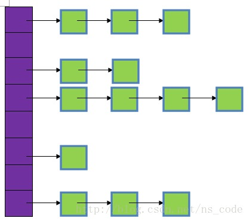

## HashMap碰撞失败了，怎么优化？
HashMap是利用key的hashcode散列算出key在table表中的位置来存储数据的，HashMap碰撞失败是指，当key的hashcode不同时算出来的位置确是相同，这里有出现了冲突。有两种解决问题的方案：扩容和链表法。
- 扩容法：将table数组的容量变大以减小冲突的可能性，如果出现冲突再重新计算存放位置。
- 链表法：这也是java目前使用的方案，提供了一个链表HashMapEntry，根据hashcode算出index值后会在index位置存放HashMapEntry，当index位置已经存在值时先遍历HashMapEntry链表，如果key一样则替换对应key的值，如果不一样则将该HashMapEntry放入index位置并将它的next指向原来的值。



图中，紫色部分即代表哈希表，也称为哈希数组，数组的每个元素都是一个单链表的头节点，链表是用来解决冲突的，如果不同的key映射到了数组的同一位置处，就将其放入单链表中。
HashMap分析
```java
public V put(K key, V value) {
        if (table == EMPTY_TABLE) {
            inflateTable(threshold);
        }
        if (key == null)
            return putForNullKey(value);
        int hash = sun.misc.Hashing.singleWordWangJenkinsHash(key);// 1
        int i = indexFor(hash, table.length);// 2
		   // 3
        for (HashMapEntry<K,V> e = table[i]; e != null; e = e.next) {
            Object k;
            if (e.hash == hash && ((k = e.key) == key || key.equals(k))) {
                V oldValue = e.value;
                e.value = value;
                e.recordAccess(this);
                return oldValue;
            }
        }

        modCount++;
			// 4
        addEntry(hash, key, value, i);
        return null;
    }
```
1）根据key计算hash值
2）根据hash值和table的长度来计算数据存放的位置
3）判断key值，如果一样就替换原来的值
4）接着看`addEntry(hash, key, value, i)`源码
```java
 void addEntry(int hash, K key, V value, int bucketIndex) {
			// 1
        if ((size >= threshold) && (null != table[bucketIndex])) {
            resize(2 * table.length);
            hash = (null != key) ? sun.misc.Hashing.singleWordWangJenkinsHash(key) : 0;
            bucketIndex = indexFor(hash, table.length);
        }
			// 2
        createEntry(hash, key, value, bucketIndex);
    }
```
位置1：threshold  = loadFactor * 容量 ，threshold表示临界值；loadFactor表示加载因子；loadFactor默认是0.75 ，值越大内存利用率越高，但是出现冲突的概率也就越高，反之亦然，size表示hashmap的大小。这里主要是判断在bucketIndex位置是否存在值且size是否超过阈值，用以扩容和重新计算bucketIndex位置。
接着我们来看一下`createEntry(hash, key, value, bucketIndex);`源码：
```java
void createEntry(int hash, K key, V value, int bucketIndex) {
        HashMapEntry<K,V> e = table[bucketIndex];
        table[bucketIndex] = new HashMapEntry<>(hash, key, value, e);
        size++;
    }
```
拿到bucketIndex位置上的元素，根据该元素创建新的HashMapEntry，然后再将该HashMapEntry存放在table[bucketIndex]处。

[hashmap冲突的解决方法以及原理分析 - CSDN博客](http://blog.csdn.net/abcd1430/article/details/52745155)