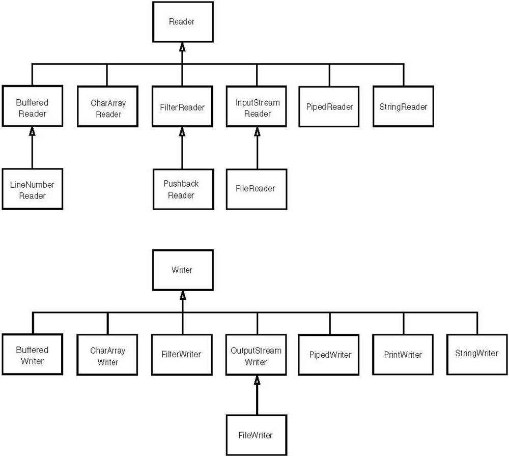

# Java 文件与流

## 文件
### 路径分隔符和名称分隔符
- 路径分隔：“;”，使用`File.pathSeparator`常量表示
- 名词分隔：“/(window)”、“\(linux)”，使用`File.separator`常量表示
**备注：我们既可以使用`String path="E:"+File.separator+"xp"+File.separator+"test"+File.separator+"2.jpg";`，也可以使用`String path = "E:/xp/test/2.jpg"`，推荐使用第二种。**
### 相对路径和绝对路径
- 相对路径：相对与某个基准目录的路径。包含Web的相对路径（HTML中的相对目录），例如：在Servlet中，"/"代表Web应用的根目录。和物理路径的相对表示，例如："./" 代表当前目录,"../"代表上级目录。这种类似的表示，也是属于相对路径。
- 绝对路径：绝对路径就是你的主页上的文件或目录在硬盘上真正的路径，(URL和物理路径)例如：`C:\xyz\test.txt` 代表了test.txt文件的绝对路径。`http://www.sun.com/index.htm`也代表了一个URL绝对路径。
```java
//默认的工程路径：/Users/he/Documents/workspace/JavaSpace/practice
File file = new File("hello.java");//基于相对路径定义File
File file1 = new File("/Users/he/Documents/workspace/JavaSpace/practice/","x.java");//绝对路径
System.out.println(file.getPath());
System.out.println(file1.getPath());
System.out.println(file.getAbsolutePath());
System.out.println(file1.getAbsolutePath());
```
输出结果：
```shell
hello.java
/Users/he/Documents/workspace/JavaSpace/practice/x.java
/Users/he/Documents/workspace/JavaSpace/practice/hello.java
/Users/he/Documents/workspace/JavaSpace/practice/x.java
```
### 常见方法与操作
- 1、文件名
```java
String getName();//文件名、路径名
String getPath()://路径名
File getAbsoluteFile();//绝对路径所对应的File对象
String getAbsolutePath();//绝对路径名
String getParent();//父目录 ,相对路径的父目录，可能为null 如. 删除本身后的结果
```
- 2、判断信息
```java
boolean exists();//是否存在
boolean canWrite();//是否可写
boolean canRead();//是否可读
boolean isFile();//是否是文件
boolean isDirectory();//是否是目录
boolean isAbsolute();//消除平台差异，以盘符开头，其他以/开头
```
- 3、长度 字节数  不能读取文件夹的长度
```java
long length();//返回文件的字节长度
```
- 4、创建、删除
```java
boolean createNewFile();//不存在创建新文件,存在返回false
boolean delete();//删除文件
static File createTempFile(String prefix, String suffix);//前缀字符串定义的文件名(必须至少有三个字符长)，后缀默认.temp
static File createTempFile(String prefix, String suffix, File directory);//前缀字符串定义的文件名(必须至少有三个字符长)，后缀默认.temp,目录
void deleteOnExit();//退出虚拟机删除,常用于删除临时文件
```
- 5、操作目录
```java
boolean mkdir();//创建目录，必须确保 父目录存在，如果不存在，创建失败
boolean mkdirs();//创建目录，如果父目录链不存在一同创建
String[]  list();//文件|目录 名字符串形式
File[] listFiles();
static File[] listRoots();//根路径
```
## 流
### 基本概念

流以程序为中心，流向程序的叫**输入流**，流出程序的叫**输出流**。
###分类
- 流向
    - 输入流
    - 输出流
- 数据
    - 字节流:二进制，可以处理一切文件，包括：纯文本、doc、音频、视频等
    - 字符流:文本文件，只能处理纯文本
- 功能:
    - 节点:包裹源头
    - 处理:增强功能，提升性能

####  字节流与字符流
**字节流**

基于"字节"操作的 I/O 接口:
- 1) **InputStream**：是一个abstract class(抽象父类)，它不能被直接用于实例化进行流操作，我们在编程中使用的是它的子类
    - 1.1) **ByteArrayInputStream**：从字节数组(byte[])中进行以字节为单位的读取
    - 1.2) **FileInputStream**：从文件中进行以字节为单位的读取
        - 1.2.1) SocketInputStream：封装了对Socket的字节型流式读取
    - 1.3) FilterInputStream：用来"封装其它的输入流，并为它们提供额外的功能"
        - 1.3.1) InflaterInputStream：从压缩数据源(zip)中以字节为单位读取数据
            - 1.3.1.1) ZipInputStream ：从zip文件中以字节为单位读取数据
        - 1.3.2) **BufferedInputStream**：开辟"内部字节数组"对输入流进行缓存，函数的返回也是一个字节数组
        - 1.3.3) DataInputStream：是用来装饰其它输入流，它"允许应用程序以与机器无关方式从底层输入流中读取基本 Java 数据类型"。应用程序可以使用DataOutputStream(数据输出流)写入由DataInputStream(数据输入流)读取的数据。
    - 1.4) **ObjectInputStream**：从输入流中读取序列化后的数据，并进行反序列化(deserializes)
    - 1.5) PipedInputStream：从管道中读取数据
- 2) **OutputStream**：是一个abstract class(抽象父类)，它不能被直接用于实例化进行流操作，我们在编程中使用的是它的子类
    - 2.1) **ByteArrayOutputStream**：以字节为单位将数据写入到从字节数组(byte[])中
    - 2.2) **FileOutputStream**：以字节为单位将数据写入到文件中
        - 2.2.1) SocketOutputStream：封装了对Socket的字节型流式写入
    - 2.3) FilterOutputStream：用来"封装其它的输出流，并为它们提供额外的功能"
        - 2.3.1) ZipOutputStream：以字节为单位向zip文件写入数据
        - 2.3.2) PrintStream：是用来装饰其它输出流。它能为其他输出流添加了功能，使它们能够方便地打印各种数据值表示形式
        - 2.3.3) DataOutputStream：是用来装饰其它输入流，它"允许应用程序以与机器无关方式向底层输出流中写入基本 Java 数据类型"。应用程序可以使用DataInputStream(数据输入流)写入由DataOutputStream(数据输出流)写入的数据()。有点类似管道、或者进程间通信的感觉
        - 2.3.4) **BufferedInputStream**：
    - 2.4) **ObjectOutputStream**：对数据进行序列化(serializes)，并向输出流中写入序列化后的数据
    - 2.5) PipedOutputStream：向管道中写入数据

**字符流**

基于"字符"操作的 I/O 接口
不管是磁盘还是网络传输，最小的存储单元都是字节，而不是字符，所以 I/O 操作的都是字节而不是字符，为了操作方便，java封装了一个直接写字符的 I/O 接口，这里就涉及到java的流机制中的一个很重要的概念，包装(装饰)。即所有的流操作在底层实现都是字节流的形式，以这个底层字节流为基础，在其上封装了各种"附加功能"(缓存、字符、管道..)
- 1) **Reader**：是一个abstract class(抽象父类)，它不能被直接用于实例化进行流操作，我们在编程中使用的是它的子类
    - 1.1) **InputStreamReader**：我们知道，字符型的流接口是在字节型的流接口基础之上进行了一次封装，提供了一些额外的功能。所以，从名字上也可以看出来，InputStreamReader是字节流通向字符流的桥梁，封裝了InputStream在里头, 它以较高级的方式,一次读取一个一个字符，以文本格式输入/输出，可以指定编码格式。
        - 1.1.1) **FileReader**：提供对文本文件(保存字符的文件)进行以字符为单位的读取
    - 1.2) **BufferedReader**：BufferedReader会一次性从物理流中读取8k(默认数值,可以设置)字节内容到内存，如果外界有请求，就会到这里存取，如果内存里没有才到物理流里再去读。即使读，也是再8k，而直接读物理流，是按字节来读。对物理流的每次读取，都有IO操作。IO操作是最耗费时间的。BufferedReader就是减少了大量IO操作，节省了时间
    - 1.3) **CharArrayReader**：CharArrayReader 是字符数组输入流。它和ByteArrayInputStream类似，只不过ByteArrayInputStream是字节数组输入流，而CharArray是字符数组输入流。CharArrayReader 是用于读取字符数组，它继承于Reader。操作的数据是以字符为单位
    - 1.4) FilterReader：用来"封装其它的字符输入流，并为它们提供额外的功能"
    - 1.5) PipedReader：PipedReader 是字符管道输入流，它继承于Reader。
    - 1.6) **StringReader**：以String作为数据源，进行以字符为单位的读取
- 2) **Writer**：Writer类是一个abstract class(抽象父类)，它不能被直接用于实例化进行流操作，我们在编程中使用的是它的子类
    - 2.1) **OutputStreamWriter**:
        - 2.1.1) **FileWriter**: 提供对文本文件(保存字符的文件)进行以字符为单位的写入
    - 2.2) **BufferedWriter**
    - 2.3) **StringWriter**
    - 2.4) PipedWriter
    - 2.5) PrintWriter 
    - 2.6) **CharArrayWriter**
**字节流与字符流总结**


#### 节点流与处理流


### 编码与解码
- 编码与解码概念
    - 编码：  字符   --编码字符集-->  二进制
    - 解码 : 二进制   --解码字符集-->  字符
```java
        String src = "中文";
//        编码：  字符   --编码字符集-->  二进制
        byte[] encodeByte = src.getBytes("utf-8");//指定编码方案，在类linux系统下默认是utf-8，在windows下默认是gbk
//        解码 : 二进制   --解码字符集-->  字符
        String decodeStr = new String(encodeByte,"utf-8");//解码
```
- 乱码
    - 编码与解码的字符集不统一
    - 字节缺少，长度丢失
```java
String src = "中文";
byte[] encodeByte = src.getBytes("utf-8");//指定编码方案为utf-8
//乱码1：编解码字符集一不一致
String error1 = new String(encodeByte,"gbk");//解码
System.out.println(error1);//打印结果是乱码，证明解码与编码所使用的字符集不一致
//乱码2：字节缺失
String error2 = new String(encodeByte,0,encodeByte.length-1,"utf-8");//创建字符串时我们刻意少一位
System.out.println(error2);
//正确结果
String success = new String(encodeByte,"utf-8");
System.out.println(success);
```
#### 转换流【处理字符乱码问题】
- 转换流: 字节转为字符
    - 输出流 OutputStreamWriter 编码
    - 输入流 InputStreamReader  解码
```java
public static void testConversion() throws IOException {
    //我们以文本文件拷贝为例：有时候我们在拷贝文件的时候，在未指定拷贝文件编码的时候，是极有可能出现乱码的，为了解决这样的问题，我们使用转换流来处理乱现象。

    String srcFile = "/Users/he/Desktop/test/src/test.txt";
    String destFile = "/Users/he/Desktop/test/src/dest.txt";
    BufferedReader br = new BufferedReader(
            new InputStreamReader(
                    new BufferedInputStream(
                            new FileInputStream(srcFile)), "utf-8"));//指定解码字符集
    BufferedWriter bw = new BufferedWriter(
            new OutputStreamWriter(
                    new BufferedOutputStream(
                            new FileOutputStream(destFile)),"utf-8"));//指定编码字符集
    String buffer = null;
    while (null != (buffer = br.readLine())) {
        bw.write(buffer);
        bw.newLine();
    }
    bw.flush();
    bw.close();
    br.close();
}
```

