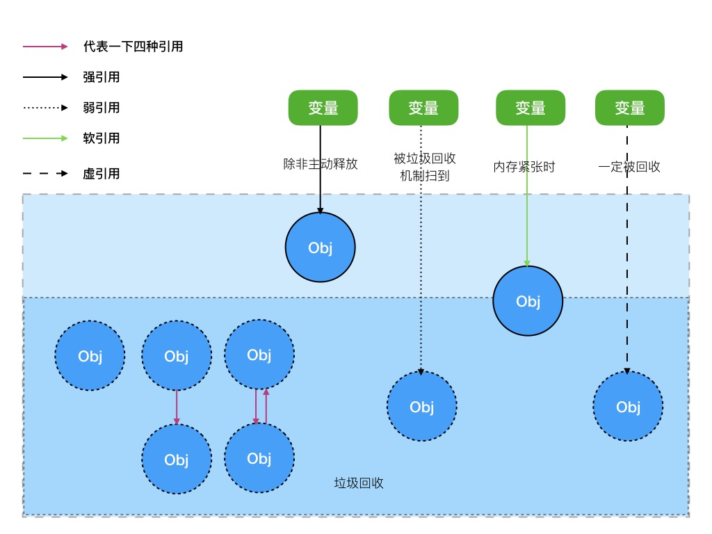

# Java引用相关
> 由于经常搞不清java各个引用的作用以及便于理解记忆特写此文。

## 简介
java拥有四种类型的引用，每个引用之间有着不同的作用以及使用场景，基本介绍如下图：

上图对照对比分析了四种不同的引用。下面分别对上图作一些说明：
浅蓝色和深蓝色的区域代表内存堆区，用来存放对象，与浅蓝色不同的是深蓝表示能够被回收的对象，而绿色块表示在栈中所声明的变量。没有来自任何栈区变量引用的对象都会被垃圾回收器回收（包含堆内存中独立的对象、单方引用的对象以及相互引用的对象）。
## 四种引用回收策略如下：
- 强引用：这种引用如果不主动释放（置空：'=null'）垃圾回收器不会对其回收，直到发生OOM。
- 弱引用：当垃圾回收器扫描到持有该引用的对象时才会对其进行回收。
- 软引用：当内存不足时才会回收。
- 虚引用：等同于=null。
## 虚引用的应用
当我们需要监听某个对象的回收情况的时候我们就可以使用虚引用+ReferenceQueue，具体使用参考引用。

## 引用
[Java幽灵引用的作用](http://blog.csdn.net/imzoer/article/details/8044900)