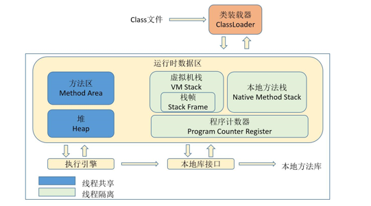
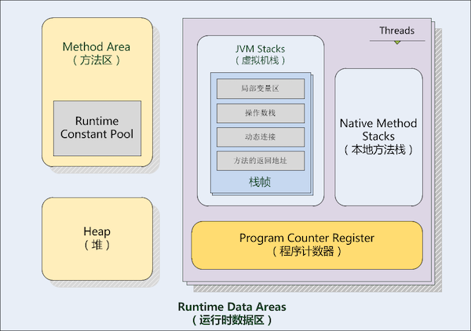

# Java 内存模型
掌握Java虚拟机内存模型对我们开发出可用的应用程序虽然没有必然的联系，但是我们绝不止步于可用，我们要求我们的程序需要具备稳定、可靠、安全等，所以有了这篇文章，当然，这篇文章并不是自己研究源码之后的创作，这只是阅读《深入理解java虚拟机》之第二章后的一点点总结，不仅如此，本文中的大多数说明都是摘自书中。
## 运行时数据区域
Java虚拟机在执行Java程序的过程中会把它的管理的内存划分为不同的数据区域，这些区域都有着各自的作用，以及创建和销毁时间，有的区域随着虚拟机进程的启动而存在，有些区域依赖用户线程的启动和结束而建立和销毁。如下图所示

如上图，蓝色区域都是线程间共享，其他区域是线程隔离的。为了便于学习，我们将运行时数据区单独拿出来研究。

## 程序计数器
程序计数器英文为Program Counter Register，是一块较小的内存空间，它是线程隔离的，表示当前线程执行的字节码的行号指示器。在虚拟机的概念模型里，字节码解释器工作时就是通过改变这个计数器的值来选取下一条需要执行的字节码指令，分支、循环、跳转、异常处理、线程恢复等基础功能都需要依赖它完成。
如果线程执行的是一个java的方法，这个计数器记录的是正在运行的虚拟机字节码指令的地址，如果执行的是native方法，那这个计数器的值则为空（Undefined）。另外此区域没有规定任何OutOfMemoryError异常情况。
## Java虚拟机栈
同程序计数器一样，java虚拟机栈也是线程私有的，它的生命周期与线程相同。虚拟机栈是描述的是java方法执行的内存模型，如上图所示：每个方法在执行的同时都会创建一个栈帧（Stack Frame）用于存储局部变量表、操作数栈、动态链接、方法的返回地址等信息，每一个方法从执行到结束完成的过程，就对应着一个栈帧在虚拟机栈中入栈到出栈的过程。这里特别说明一下：局部变量表所需的内存空间在编译期间完成分配，当进入一个方法时，这个方法需要在帧中分配多大的局部变量空间是完全确定的，在方法运行期间是不会改变局部变量表的大小。
在java虚拟机规范中，对这个区域规定了两种异常状况：如果线程请求的栈深度大于虚拟机所允许的深度，将抛出StackOverflowError异常；如果虚拟机栈可以动态扩展（当前大部分的Java虚拟机都可动态扩展，只不过Java虚拟机规范中也允许固定长度的虚拟机栈），如果扩展时无法申请到足够的内存，就会抛出OutOfMemoryError异常。
## 本地方法栈
本地方法栈（Native Method Stack）与虚拟机栈所发挥的作用是非常相似的，它们之间的区别不过是虚拟机栈为虚拟机执行Java方法（也就是字节码）服务，而本地方法栈则为虚拟机使用到的Native方法服务。与虚拟机栈一样，本地方法栈区域也会抛出StackOverflowError和OutOfMemoryError异常。
## Java堆
对于大多数应用来说，Java堆（Java Heap）是Java虚拟机所管理的内存中最大的一块。Java堆是被所有线程共享的一块内存区域，在虚拟机启动时创建。此内存区域的唯一目的就是存放对象实例，几乎所有的对象实例都在这里分配内存。这一点在Java虚拟机规范中的描述是：所有的对象实例以及数组都要在堆上分配[1]，但是随着JIT编译器的发展与逃逸分析技术逐渐成成熟，栈上分配、标量替换优化技术将会导致一些微妙的变化，所有的对象都分配在堆上也渐渐变得不是那么绝对了。Java堆是垃圾收集器管理的主要区域，因此很多时候也被成为“GC堆”（Garbage Collected Heap）。
根据Java虚拟机规范的规定，Java堆可以处于物理上不连续的内存空间中，只要逻辑上是连续的即可，就像我们的磁盘空间一样。如果在堆中没有内存完成实例分配，并且堆也无法再扩展时，将会抛出OutOfMemoryError异常。
## 方法区
方法区（Method Area）与Java堆一样，是各个线程共享的内存区域，它用于存储已被虚拟机加载的类信息、常量、静态变量、即时编译器编译后的代码等数据。虽然Java虚拟机规范把方法区描述为堆的一个逻辑部分，但是它却有一个别名叫做Non-Heap（非堆），目的应该是与Java堆区分开来。
Java虚拟机规范对方法区的限制非常宽松，除了和Java堆一样不需要连续的内存和可以选择固定大小或者可扩展外，还可以选择不实现垃圾收集。相对而言，垃圾收集行为在这个区域是比较少出现的，但并非数据进入了方法区就如永久代的名字一样“永久”存在了。
根据Java虚拟机规范的规定，当方法区无法满足内存分配需求时，将抛出OutOfMemoryError异常。
## 运行时常量池
运行时常量池（Runtime Constant Pool）是方法区的一部分。Class文件中除了有类的版本、字段、方法、接口等描述信息外，还有一项信息是常量池（Constant Pool Table），用于存放编译期生成的各种字面量和符号引用，这部分内容将在类加载后进入方法区的运行时常量池中存放。
运行时常量池相对于Class文件常量池的另外一个重要特征是具备动态性，Java语言并不要求常量一定只有编译期才能产生，也就是并非预置入Class文件中常量池的内容才能进入方法区运行时常量池，运行期间也可能将新的常量放入池中，这种特性被开发人员利用得比较多的便是String类的intern()方法（关于String的intern方法，可以阅读[此](https://tech.meituan.com/in_depth_understanding_string_intern.html)）。
当常量池无法再申请到内存时会抛出OutOfMemoryError异常。
## 直接内存
直接内存（Direct Memory）并不是虚拟机运行时数据区的一部分，也不是Java虚拟机规范中定义的内存区域。但是这部分内存也被频繁地使用，而且也可能导致OutOfMemoryError异常出现。在JDK 1.4中新加入了NIO（New Input/Output）类，引入了一种基于通道（Channel）与缓冲区（Buffer）的I/O方式，它可以使用Native函数库直接分配堆外内存，然后通过一个存储在Java堆中的DirectByteBuffer对象作为这块内存的引用进行操作。这样能在一些场景中显著提高性能，因为避免了在Java堆和Native堆中来回复制数据。
服务器管理员在配置虚拟机参数时，会根据实际内存设置-Xmx等参数信息，但经常忽略直接内存，使得各个内存区域总和大于物理内存限制（包括物理的和操作系统级的限制），从而导致动态扩展时出现OutOfMemoryError异常。
**特别说明，以上分析都是基于java1.6版本**
## Java8的变化
从JDK7已经开始永久代的移除工作了，贮存在永久代的一部分数据已经转移到了Java Heap或者是Native Heap。但永久代仍然存在于JDK7，并没有完全的移除：
- 符号引用(Symbols)转移到了native heap;
- 字面量(interned strings)转移到了java heap;
- 类的静态变量(class statics)转移到了java heap。
Jdk8 中方法区被完全的移除了，直接使用本地内存来表示类的元数据，这个区域就叫做元空间。
JVM会忽略PermSize和MaxPermSize这两个参数，也不会出现java.lang.OutOfMemoryError: PermGen error的异常了。
```java
public class StringOomMock {
    private static String  base = "string";
    public static void main(String[] args) {
        List<String> list = new ArrayList<String>();
        for (int i=0;i< Integer.MAX_VALUE;i++){
            String str = base + base;
            base = str;
            list.add(str.intern());
        }
    }
}
```
在jdk8下，抛出如下异常：
```java
Exception in thread "main" java.lang.OutOfMemoryError: Java heap space
    at java.util.Arrays.copyOf(Arrays.java:3332)
    at java.lang.AbstractStringBuilder.expandCapacity(AbstractStringBuilder.java:137)
    at java.lang.AbstractStringBuilder.ensureCapacityInternal(AbstractStringBuilder.java:121)
    at java.lang.AbstractStringBuilder.append(AbstractStringBuilder.java:421)
    at java.lang.StringBuilder.append(StringBuilder.java:136)
    at memory.StringOomMock.main(StringOomMock.java:14)
    at sun.reflect.NativeMethodAccessorImpl.invoke0(Native Method)
    at sun.reflect.NativeMethodAccessorImpl.invoke(NativeMethodAccessorImpl.java:62)
    at sun.reflect.DelegatingMethodAccessorImpl.invoke(DelegatingMethodAccessorImpl.java:43)
    at java.lang.reflect.Method.invoke(Method.java:498)
    at com.intellij.rt.execution.application.AppMain.main(AppMain.java:140)

Process finished with exit code 1
```
可以看到发生了堆内存溢出，可见字符串常量已经由永久代转移到堆中。

## 参考
- 《深入理解Java虚拟机》- 周志明 > 第二章
- [Java永久代去哪儿？](https://www.infoq.cn/article/Java-PERMGEN-Removed)