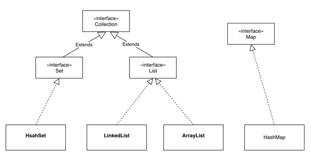
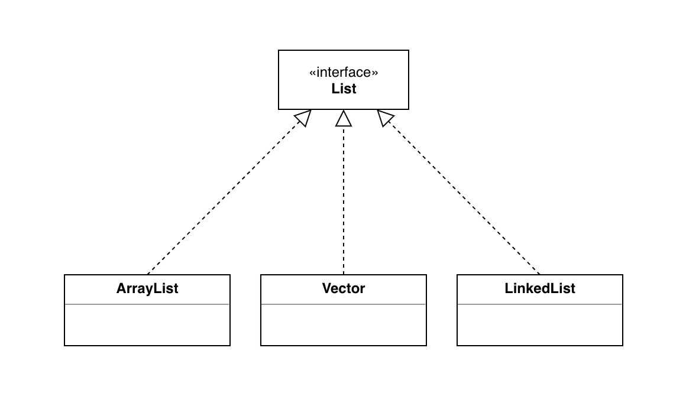
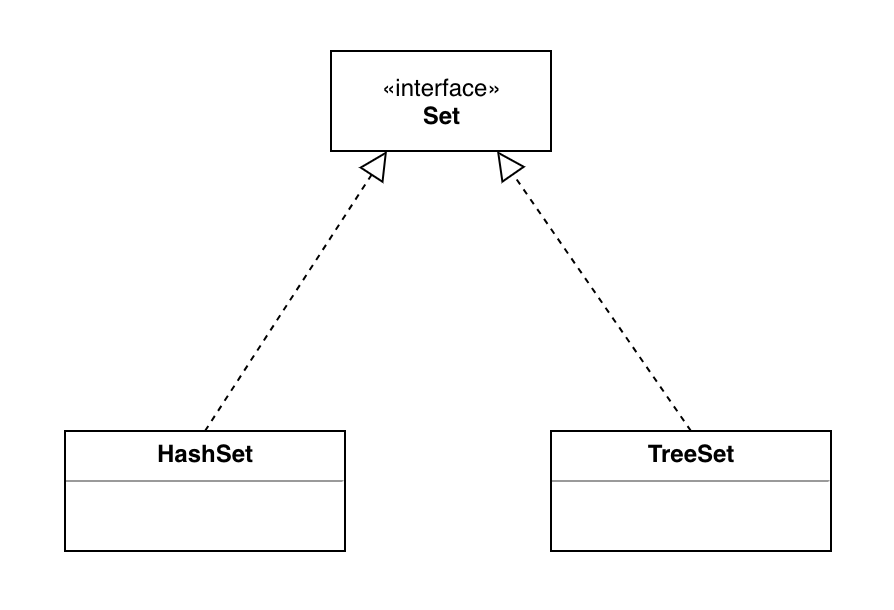
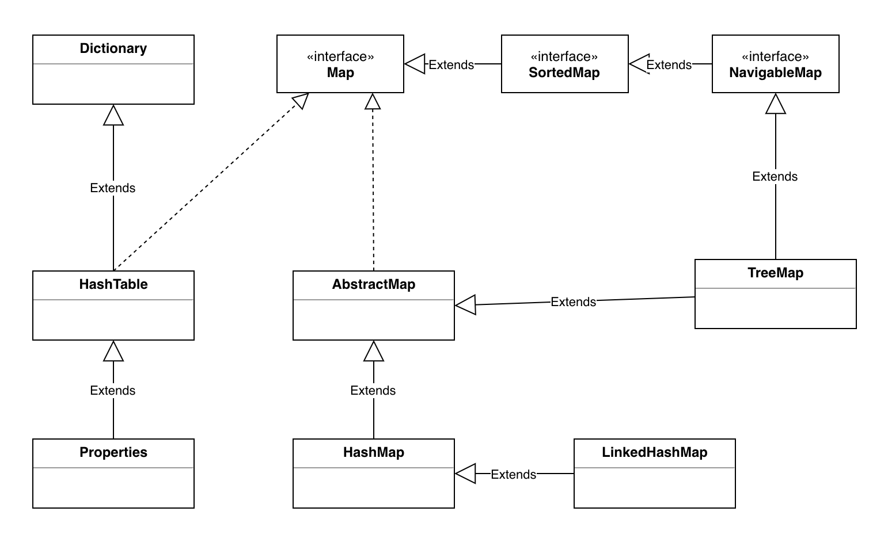

# 容器
**这一章需要记住一个图，一个类，三个知识点，6个接口**
- 一图⭐️
 
- 一个类
    - Collections ⭐️
- 三个知识点
    - For  ⭐️
    - Generic ⭐️
    - Auto-boxing/unboxing ⭐️

## Collection
Collection接口——定义了存取一组对象的方法，其子接口Set和List分别定义了存储方式。
- Set里的数据没有顺序且不能重复
- List里的数据有顺序但是可以重复
List中的数据可以重复是指他们两个对象之间互相equals相同就算重复！
接口中的remove方法里删除的对象是跟容器中equals相同的对象！
**注意：重写一个对象的equals方法要重写它的hashCode方法，要保证两个对象相同那么它们的hashCode也要相同。**
## List接口

List为有序的Collection，此接口的用户可以对列表中的每个元素的插入位置进行精确的定位，用户可以根据元素的整数索引（在列表中的位置）访问元素，并搜索列表当中的元素。与set不同，列表通常允许重复的元素，更精确的讲列表通常允许满足e1.equals(e2)条件的元素e1，e2并存，**并且如果列表本身允许null元素的话，通常他们允许多个null元素。**
常用的实现类有：ArrayList、LinkedList、Vector。
- ArrayList:  底层用数组实现的List,特点是：查询效率高 ，增删效率低，不安全。
- LinkedList:底层是双向链表实现的List,特点是：查询效率低，增删效率高，线程不安全。
    - LinkedList 类还为在列表的开头及结尾 get、remove 和 insert 元素提供了统一的命名方法。这些操作允许将链接列表用作堆栈、队列或双端队列。
    - 此类实现 Deque 接口，为 add、poll 提供先进先出队列操作，以及其他堆栈和双端队列操作。
- Vector:底层用数组实现的List,特点：线程安全.
**如何选用？**
- 线程安全用Vector.
- 线程不安全，查找较多用ArrayList，增加或删除元素较多用LinkedList.
## set接口

HashSet采用哈希算法实现的Set，特点是：没有是顺序，不可以重复，重复的元素添加进行会出现覆盖的现象。
HashSet的底层是用HashMap实现的，因此查询效率较高，由于采用hashCode算法直接确定元素的内存地址，增删效率也挺高的。
## Iterator接口
Iterator对象称作为迭代器，用以方便的对容器内元素的遍历操作，所有实现了Collection接口的容器类都有一个iterator方法用以返回一个实现Iterator接口的对象。Iterator接口定义了如下方法：
```java
    boolean hashNext();//判断是否有元素没有被遍历
    Object next();//返回游标当前位置的元素并将游标移动到下一个位置
    void remove();//删除游标左边的元素，在执行完next之后该操作只能执行一次。
```
## 增强for循环

## Comparable和Comparator
java中，对集合对象或者数组对象排序，有两种实现方式。即：
（1）对象实现Comparable 接口
（2）定义比较器，实现Comparator接口。
### Comparable
Comparable是在集合内部定义的方法实现的排序，位于java.lang下。Comparable 接口仅仅只包括一个函数，它的定义如下：
```java
package java.lang;
import java.util.*;
 
public interface Comparable<T> {
    public int compareTo(T o);
}
```
- 若x.compareTo(y) <0，则x<y;若x.compareTo(y) =0，则x=y;若x.compareTo(y) >0，则x=y;
- Comparable是一个对象，本身就已经支持自比较所需要实现的接口。
- 自定义类要在加入list容器中后能够排序，也可以实现Comparable接口。
- 在用Collections类的sort方法排序时若不指定Comparator，那就以自然顺序排序。所谓自然顺序就是实现Comparable接口设定的排序方式。
- 若一个类实现了comparable接口，则意味着该类支持排序。如String、Integer自己就实现了Comparable接口，可完成比较大小操作。
- 一个已经实现comparable的类的对象或数据，可以通过Collections.sort(list) 或者Arrays.sort(arr)实现排序。通过Collections.sort(list,Collections.reverseOrder());对list进行倒序排列。
### Comparator
Comparator是在集合外部实现的排序，位于java.util下。Comparator接口包含了两个函数。
```java
package java.util;
public interface Comparator<T> {
    int compare(T o1, T o2);
    boolean equals(Object obj);
}
```
- 我们若需要控制某个类的次序,而该类本身不支持排序(即没有实现Comparable接口);那么，我们可以新建一个该类的比较器来进行排序。这个比较器只需要实现comparator即可。
- 如果引用的为第三方jar包，这时候，没办法改变类本身，可是使用这种方式。
- Comparator是一个专用的比较器，当这个对象不支持自比较或者自比较函数不能满足要求时，可写一个比较器来完成两个对象之间大小的比较。
- Comparator体现了一种策略模式(strategy design pattern)，就是不改变对象自身，而用一个策略对象(strategy object)来改变它的行为。
**comparable相当于内部比较器。comparator相当于外部比较器。**
## 排序容器
TreeSet：元素不可以重复，元素可以排序，添加数据时自动进行排序，TreeSet存储数据尽量不要修改。
TreeMap：要求key可以排序，与TreeSet同理。

## 自动装箱/拆箱机制

## Collections
类Collections是一个**包装类**。它包含有各种有关集合操作的静态多态方法。此类不能实例化，就像一个工具类，服务于Java的Collection框架。
Collections中常用的方法：
```java
binarySearch(List<? extends Comparable<? super T>> list, T key);//二分法查找，容器必须有序
sort(List<T> list);//排序，T必须实现Comparable接口
sort(List<T> list, Comparator<? super T> c);//排序，传入Comparator
reverse(List<?> list);//反转
shuffle(List<?> list);//可以实现洗牌效果
swap(List<?> list, int i, int j);//交换元素
```
## 队列Queue,与Deque

## Map接口

Map接口定义了存储“键（key）- 值（Value）映射对”的方法。
**HashTable与HashMap的区别？**
- 主要：Hashtable线程安全，同步，效率低下；HashMap线程不安全，非同步，效率相对高
- 父类：Hashtable 是Dictionary,HashMap是AbstractMap
- null:Hashtable键与值不能为null；HashMap键最多一个null,值可以多个null
## 泛型 【略】


OK，That's all. 🍻