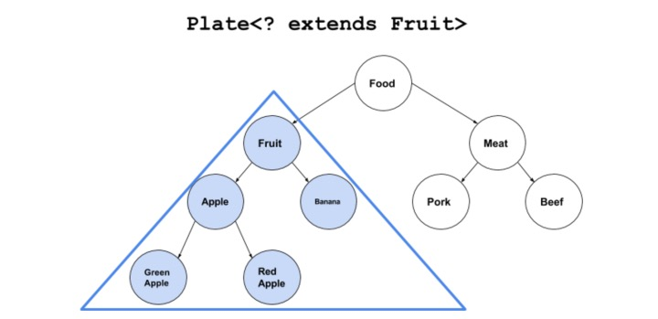
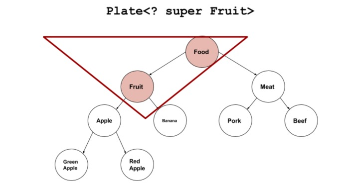

# 泛型

## 泛型入门
### 简介
泛型是Java 1.5版本推出的一项重要功能，其目的是**编写更通用的代码，要使代码能够应用于“某种不具体的类型”，而不是一个具体的接口或类**。
Java泛型的核心概念：** 告诉编译器想使用什么类型，然后编译器帮你处理一些细节。**

### 命名规则
命名规则一般没有强制性，但通常我们约定类型参数命名为单个大写的字母，这样的共同认识也便于我们今后代码的阅读。如下：
- E - Element（Java Collections框架大量使用）
- K - Key
- N - Number
- T - Type 
- V - Value
- S,U,V 等 - 第二，第三，第四类通用型参数
## 深入泛型
### 泛型继承
- 泛型继承
    - 1、保留父类泛型 子类必须 >= 父类
        - 全部保留
        - 部分保留
    - 2、不保留父类泛型
        - 具体类型
        - 没有类型
- 属性 及方法 类型 -->随位置而定
    - 1、子类重写方法/属性的类型 -->随父类而定
    - 2、子类新增方法/属性的类型 -->随子类而定
```java
//定义泛型类
abstract class Father<T1,T2>{
    T1 arg;
    public abstract void test(T2 arg);
}
//保留 -> 泛型子类
//1)全部保留
class SubGenClass<T1,T2,A,B> extends Father<T1,T2>{
    @Override
    public void test(T2 arg) {
    }
    public void test2(A a){
    }
}
//2)部分保留
class SubGenClass1<T2,A,B> extends Father<Integer,T2>{
    @Override
    public void test(T2 arg) {
    }
    public void test2(A a){
    }
}
//不保留 -> 按需实现
//1)具体类型
class SubGenClass2 extends Father<Integer,String>{
    @Override
    public void test(String arg) {
    }
}

//2)没有类型 则为泛型擦除
class SubGenClass3 extends Father{
    @Override
    public void test(Object arg) {
        //变为Object
    }
}
```
**重点：子类继承泛型父类时，如果子类需要保留泛型，此时子类泛型的个数大于等于父类泛型。如果子类不是泛型类，父类的泛型可以按需实现。**

### 泛型接口
**泛型接口与泛型类同理**
### 泛型擦除
泛型的擦除: 使用时 |实现|继承 没有指定类型 ，类似于Object ,不等同于Object。
```java
package cn.isif;

public class TestGeneric<T> {
    public static void main(String[] args) {
        //泛型擦除
        Student student = new Student();
        student.setValue(123);
        Object v = student.getValue();

        test(student);//编译时不会类型检查

        Student<Object> student2 = new Student<Object>();
        //不等于Object
        test(student);
    }
    public static void test(Student<Integer> student){}
}

class Student<T>{
    private T t;
    public void setValue(T t){
        this.t = t;
    }
    public T getValue(){
        return t;
    }
}
```
### 通配符
**? **：通配符，类型不确定，用于声明变量|形参上。
不能用在
- 1、创建对象
- 2、创建泛型类 泛型方法 泛型接口上
```java
package cn.isif;

import java.util.ArrayList;
import java.util.List;

public class TestGeneric<T> {
    public static void main(String[] args) {
        List<?>  list = new ArrayList<Integer>();
        list = new ArrayList<String>();
        list = new ArrayList<Double>();
        test(list);
        //不能用在创建对象上
//        list = new ArrayList<?>();
    }
    public static void test(List<?> list){}
    //不能用在泛型方法上
//    public static <?> void test1(){}
    //不能用在泛型类和接口上
//    class Hell<?>{}
}
```
### extends，泛型的上限
extends : 泛型的上限  <= 即子类或自身

- 1、一般用于限制操作
- 2、不能使用在添加数据上面，一般都是读取操作
- 3、规则
    - List<Fruit> -->List<? extends Fruit>
    - List<Apple> -->List<? extends Fruit>
    - List<? extends Apple> -->List<? extends Fruit>
- 不能存放
    - List<?>
    - List<? extends Object>
**特点：上界<? extends T>不能往里存，只能往外取**
```java
package cn.isif;

import java.util.ArrayList;
import java.util.List;

public class TestGeneric<T> {
    public static void main(String[] args) {
        List<? extends Fruit> l1 = new ArrayList<>();
        test(l1);
        List<? extends Apple> l2 = new ArrayList<>();
        test(l2);
        List<Pear> l3 = new ArrayList<>();
        test(l3);
        List<? extends Object> l4 = new ArrayList<>();
//        test(l4);//错误，Object > Fruit
        List<?> l5 = new ArrayList<>();
//        test(l5);//? -->为什么错误 ,因为 ? 等同于 ? extends Object
    }

    public static void test(List<? extends Fruit> fruits){
        //不能用与数据的添加，所以下列操作错误
//        fruits.add(new Apple());
//        fruits.add(new Fruit());
//        fruits.add(new Pear());
    }
}

class Fruit{
}

class Apple extends Fruit {
}

class Pear extends Fruit {
}
//用于泛型类
class Test<T extends Fruit>{
}
```
### super，泛型的下限
super : 泛型的下限  >= 即父类或自身

- 1、一般用于下限操作
- 2、能够添加数据上面，不能添加父对象
- 3、规则
    - List<Fruit> -->List<? super Apple>
    - List<Apple> -->List<? super Apple>
    - List<? super Fruit> -->List<?super Apple>
- 不能存放
    - List<? super FujiApple> -->List<?super Apple>
**特点：下界<? super T>不影响往里存，但往外取只能放在Object对象里**
```java
package cn.isif;

import java.util.ArrayList;
import java.util.List;

public class TestGeneric<T> {
    public static void main(String[] args) {
        List<? super Fruit> l1 = new ArrayList<>();
        test(l1);
        List<? super Apple> l2 = new ArrayList<>();
        test(l2);
        List<Apple> l3 = new ArrayList<>();
        test(l3);
        List<? super Object> l4 = new ArrayList<>();
        test(l4);//错误，Object > Fruit
        List<? super FujiApple> l6 = new ArrayList<>();
//        test(l6);
        List<?> l5 = new ArrayList<>();
//        test(l5);//? -->为什么错误 ,因为 ? 等同于 ? extends Object
    }
    public static void test(List<? super Apple> apples){
        //向容器里添加数据时需注意：只能添加类本身或者类的子类对象！！！
        apples.add(new Apple());
        apples.add(new FujiApple());
//        apples.add(new Object());
//        fruits.add(new Pear());
//        fruits.add(new Fruit());//不能添加父类
    }
}
class Fruit{
}
class Apple extends Fruit {
}
class Pear extends Fruit {
}
class FujiApple extends Apple{
}
```
### 泛型的嵌套
泛型嵌套 -->由外到内拆分
```java
package cn.isif;

import java.util.ArrayList;
import java.util.List;

public class TestGeneric<T> {
    public static void main(String[] args) {
        Student<String> stu = new Student<>();
        stu.setScore("优秀");
        System.out.println(stu.getScore());
        //泛型嵌套
        List<Student<String>> students = new ArrayList<>();
        students.add(new Student<>("良好"));
        String score = students.get(1).getScore();
        System.out.println(score);
    }
}

class Student<T> {
    private T score;
    public Student() {
    }
    public Student(T t) {
        this.score = t;
    }
    public T getScore() {
        return score;
    }
    public void setScore(T score) {
        this.score = score;
    }
}
```
### 其他
```java
package cn.isif;

public class TestGeneric<T> {
//    public static T t; //泛型不能用在静态变量上
    public static void main(String []args){
//        TestGeneric f = new TestGeneric<int>();//泛型不能为基本数据类型，必须为基本数据类型的包装类
    }
    public void test1(T t){
        System.out.println("T不能为基本类型");
    }
    public static <V> void test(V t){//在静态方法上定义泛型
        }
}
```
- 泛型没有多态：`//List<Fruit> list =new ArrayList<Apple>();` ❌
- 泛型没有数组：`//Fruit<String>[] arr =new Fruit<String>[10];` ❌


