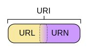
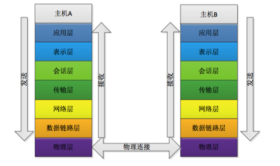
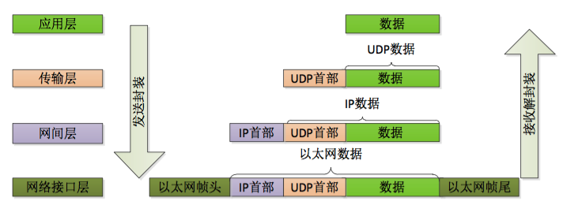

## 基本概念

**什么是网络？**

通俗的讲，就是将不同区域的计算机连在一起，按照计算机连接的大小又可以将网络分为：局域网、城域网和互联网。

**地址**

计算机之间通讯就的需要地址，呐，物理地址和ip地址就应运而生了。物理地址指的是计算机网卡地址，用于链路层或物理层之间的通讯，ip地址用于网络层。

**端口号**

端口号是用来区分计算机上不同应用程序的，可用区间[0~65535]，1024以下被系统占用，一般不用，**同一协议下，端口号不可以重复，不同协议下可以重复**。

**资源定位**

URL（Universal Resource Locator）：统一资源定位符

URI（Universal Resource Identifier）：统一资源标识符

URN（Universal Resource Name）： 统一资源名称

这三者的关系如下图：



## 网络分层

### OSI模型

OSI 模型(Open System Interconnection model)是一个由国际标准化组织􏰁提出的概念模型,试图􏰁供一个使各种不同的计算机和网络在世界范围内实现互联的标准框架。



#### 各层作用

**物理层**：由于计算机内部处理的是二进制数据，所以物理层需要完成的工作就是将各种电信号、光信号、磁场信号等转化为二进制数据，或者将二进制数据转成这些用于传输的数据。

**数据链路层**：数据链路层的作用就是在通过传输介质互联的设备之间进行数据处理。

**网络层**：网络层的作用是在网络中，将数据由主机A发送到主机B。在实际发送数据的过程中，我们需要知道目的地址（IP地址）。基于这个地址，数据才可以在众多计算机中选择一个进行数据传输。

**传输层**：建立连接或断开连接的处理，是由传输层所决定的。而当数据传输错误时，传输层也会负责数据的重发重传。比如：主机A和主机B之间准备进行通讯了，这一过程就叫做建立连接的过程。有了这个通信连接，就可以将主机A所发送的内容传送到主机B当中。当通信结束后，连接有必要断开。

**PS:会话层决定建立连接和断开连接的时机，传输层会进行实际的建立连接和断开连接的处理。**

**会话层**：决定采用什么连接方法是会话层的主要责任。假定主机A发送多封电子邮件，这多封电子邮件就有了很多种发送方式，是选择建立连接后一次性发送？还是建立多次一封一封的发送？甚至还可以建立多个连接同时发送。这就是会话层的主要责任。

**表示层**：决定数据的展现（编码）形式，如：mp4、jgp、txt等。

**应用层**：应用软件使用的协议，如邮箱pop3、smtp，浏览器http/https等。

### TCP/IP 分层模型

TCP/IP协议栈是美国国防部高级研究计划局计算机网（Advanced Research Projects Agency Network，ARPANET）和其后继因特网使用的参考模型。



**OSI是一种理论下的模型，而TCP/IP已被广泛使用，成为网络互联事实上的标准。**

## 网络爬虫原理

```java
package cn.isif.net;


import java.io.BufferedReader;
import java.io.IOException;
import java.io.InputStreamReader;
import java.net.MalformedURLException;
import java.net.URL;

public class GetWebSite {
    public static void main(String []args){
        try {
            //定义访问的资源
            URL url = new URL("https://isif.cn");
            //获取资源，使用InputStreamReader接收流，防止乱码
            InputStreamReader isr = new InputStreamReader(url.openStream(),"utf-8");
            BufferedReader br = new BufferedReader(isr);//缓冲
            String content;
            while ((content = br.readLine())!=null){
                System.out.println(content);
            }
            isr.close();
            br.close();
        } catch (MalformedURLException e) {
            e.printStackTrace();
        } catch (IOException e) {
            e.printStackTrace();
        }
    }
}

```

爬虫最基本的原理就是下载网页内容，当然我们这里并不是真正意义的爬虫，只是把网页的内容下载下来而已，目的是为了学习URL。

## Socket编程


## UDP编程

服务端

```java
package cn.isif.net;


import java.net.DatagramPacket;
import java.net.DatagramSocket;

public class UDPServer {
    public static void main(String []args) throws Exception {
        //创建服务端 +端口
        DatagramSocket server = new DatagramSocket(8888);
        //准备接受容器
        byte [] container = new byte[1024];
        //封装成 包 DatagramPacket(byte[] buf, int length)
        DatagramPacket packet = new DatagramPacket(container,container.length);
        //接受数据
        server.receive(packet);
        //处理数据
        byte[] data = packet.getData();
        int len = packet.getLength();
        System.out.println(new String(data,0,len));
        //关闭
        server.close();
    }
}
```

客户端

```java
package cn.isif.net;


import java.net.DatagramPacket;
import java.net.DatagramSocket;
import java.net.InetSocketAddress;

public class UDPClient {
    public static void main(String []args) throws Exception {
        //创建客户端 + 端口号
        DatagramSocket client = new DatagramSocket(6666);
        //构造数据
        byte[] data = "hello".getBytes();
        //打包数据DatagramPacket
        DatagramPacket packet = new DatagramPacket(data,0,data.length,new InetSocketAddress("localhost",8888));
        //发送数据
        client.send(packet);
        //关闭
        client.close();
    }
}
```


## 参考

- [计算机网络漫谈：OSI七层模型与TCP/IP四层（参考）模型](https://www.jianshu.com/p/c793a279f698)
- [OSI七层协议模型、TCP/IP四层模型学习笔记](https://www.cnblogs.com/Robin-YB/p/6668762.html)

