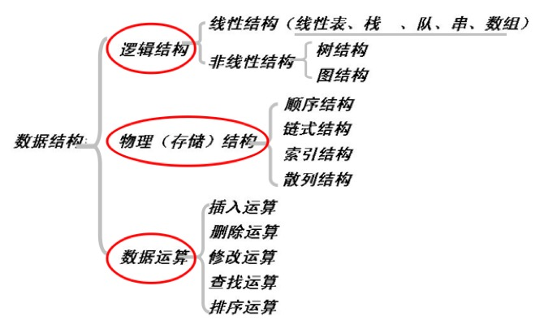
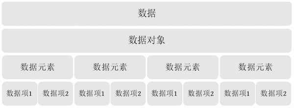
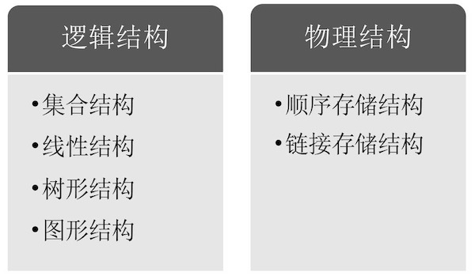
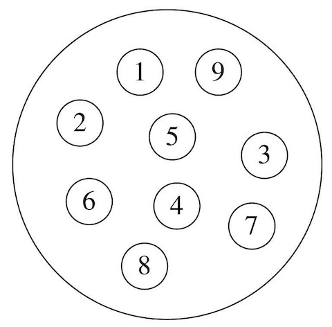
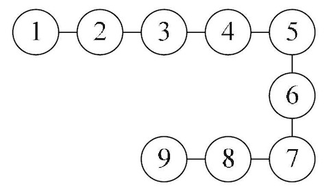
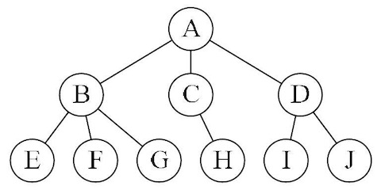
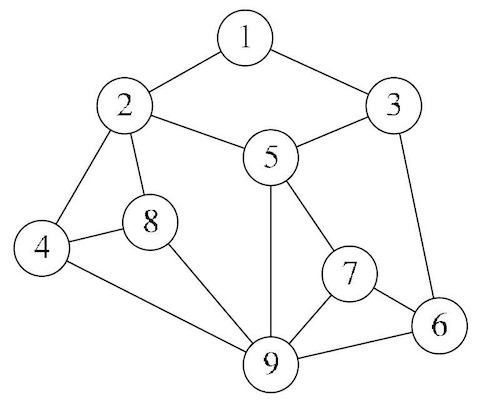
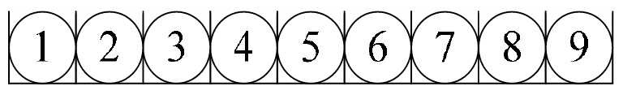
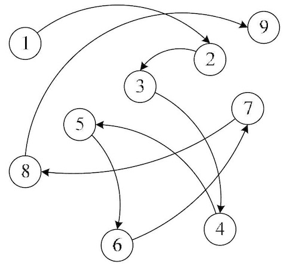
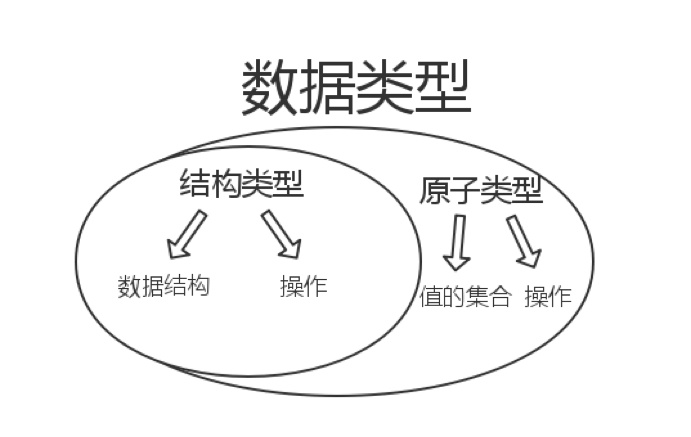

# 1 绪论

## 1.1 数据结构的起源
早期，计算机被当做数值计算的工具。但现实中，更多的问题是非数值计算问题，如：表、树、图。因此，数据结构是一门研究非数值计算的程序设计问题的操作为对象，以及它们之间的关系和操作等相关问题的学科。

## 1.2 基本概念和术语
- **数据**：所有能被计算机识别、存储和处理的符号的集合，包括：图片、声音、视频等。
- **数据对象**：具有相同性质的数据元素的集合，是数据的一个子集。
- **数据元素**：是组成数据的、有一定意义的基本单位，在计算机中通常作为整体处理。
- **数据项**：一个数据元素可以由若干个数据项组成。
- **数据结构**：是相互之间存在一种或多种特定关系的数据元素的集合。

## 1.3 逻辑结构与物理结构
按照视点的不同，数据结构可以分为逻辑结构和物理结构

### 1.3.1 逻辑结构
逻辑结构：指数据对象中数据元素之间的相互关系。
- 集合结构

集合结构中的数据元素**除了同属于一个集合外，没有其他关系**。
- 线性结构

元素之间存在**一对一关系**。
- 树形结构

元素之间存在**一对多的层次关系**。
- 图形结构

元素间存在**多对多关系**。
### 1.3.2 物理结构
物理结构：是指数据的逻辑结构在计算机中的存储形式。
- 顺序存储

把数据元素存放在**地址连续的存储单元里**，其数据间的逻辑关系和物理关系是一致的。
- 链式存储

把数据元素存放在**任意的存储单元里**，这组存储单元可以使连续的，也可以不连续。
## 1.4 抽象数据类型
### 1.4.1 数据类型
数据类型：是指一组性质相同的值的集合及定义在此集合上的一些操作的总称。
- 原子类型：是不可以再分解的基本类型，包括整型、实型、字符型等。
- 结构类型：自若干个类型组合而戚，是可以再分解的。例如，整型数组是由若干整 型数据组成的。
### 1.4.2 抽象数据类型
抽象是指抽取出事物具有的普遍性的本质。
抽象数据类型：是指一个数学模型以及定义在该模型上的一组操作。其“抽象”的意义在于数据类型的数学抽象特性。

## 数据结构、数据类型、抽象数据类型关系？
数据结构：是相互之间存在一种或多种特定关系的数据元素的集合，包括逻辑结构和物理结构。
数据类型：是一个值的集合和定义在这个值集上的一组操作的总称。

抽象数据类型：是指一个数学模型以及定义在该模型上的一组操作。
**自我理解**：抽象数据类型与数据类型之间的区别，有点像Java中抽象类（接口）与其实现类之间关系一样，数据类型可以理解为某类对象具体的操作实现，而抽象数据类型代表某一类事物其操作的定义。