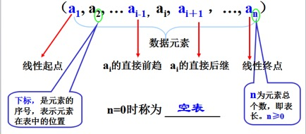

# 第一章 线性表

## 3.1 基础概念

### 3.1.1 定义

线性表(List)：零个或多个数据元素的**有限序列**。并具有以下性质：



- 有序序列，且具备：第一个元素无前驱，最后一个元素无后继，其他每一个元素都有且只有一个前驱和后继。
- 该序列是有限序列。

## 3.2 线性表的抽象数据类型


#### 数组实现
- 修改
通过数组下标即可访问特定的元素并修改它，其操作的时间复杂度为O(1).
- 插入
在数组中，如果我们要想在i位置插入一个元素，假设该表长为n则其步骤：
    - 1、将第n至第i位的元素向后移动一个位置；
    - 2、将要插入的元素写入到第i个位置；
    - 3、表长加1。
**插入时的时间复杂度为： O(n)，即最好的情况是在表尾，其时间复杂度为O(1)，最坏的情况是在表头插入，其时间复杂度为O(n)**
**注意：在移动之前，应先判断数组的长度即表是否已满**
- 删除
如：删除线性表的第i个位置上的元素，实现步骤：
    - 1、将第i+1至第n位的元素向前移动一个位置；
    - 2、表长减1。
**删除时的时间复杂度为：O(n)，即最好的情况是删除表尾数据，时间复杂度为O(1)，最坏是删除表头，时间复杂度为：O(n-1) ≈ O(n)**
**注意；需判断i位置是否合法，即是否超出了表的长度**
- 查找
在以数组为基础的链表中，查找元素可以根据数组下标来查询，其操作时间复杂度为O(1)
- 排序
视具体算法
```java
public class TableWithArray<T> {
    private int length = 0;//表的容量
    private int size = 0;//表中元素的个数
    private Object[] data;

    public TableWithArray(int length) {
        this.length = length;
        data = new Object[length];
        size = 0;
    }

    public T indexOf(int index) {
        rangeCheck(index);
        return (T) data[index];
    }

    public int add(T obj) {
        if (size <= length) {
            data[size] = obj;
            size++;
            return size;
        } else {
            return -1;
        }
    }

    public T delete(int index) {
        rangeCheck(index);
        T temp = (T) data[index];
        for (int i = index; i < size-1; i++) {
            data[i] = data[i + 1];
        }
        size--;
        return temp;
    }

    public void rangeCheck(int index) {
        if (index < 0 || index >= size) {
            throw new IndexOutOfBoundsException();
        }
    }

    public void set(int index, T obj) {
        rangeCheck(index);
        data[index] = obj;
    }

    public int size(){
        return size;
    }
}
```
#### 链表
- 单链表


## 学习重点

