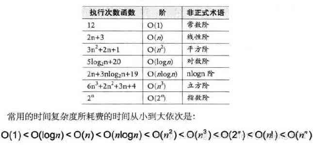

# 算法

## 2.1 算法的定义及五个特征

**算法**：是对特定问题求解步骤的一种描述，它是指令的有限序列，是一系列输入转换为输出的计算步骤。
**算法的基本特征**：输入、输出、有穷性、确定性、可行性。

## 2.2 算法设计要求

正确性、可读性、健壮性、时间效率与低存储量需求

## 2.3 算法效率的度量方法

- 事后统计法，存在以下缺陷
    - 事后估算可能导致设计完算法后因为效率问题而反复重来
    - 在不同的环境下可能对算法有一定影响，从而影响事后统计的准确性
    - 同样不同的数据规模也会影响统计结果
基于事后统计方法有这样那样的缺陷，我们考虑不予采纳。
- 事前分析估算法，影响程序效率的因素如下
    - 算法采用的策略、方法
    - 编译产生的代码质量
    - 问题的输入规模
    - 机器执行指令的速度

## 3.4 时间复杂度

### 3.4.1函数的渐进增长

如果我们使用函数f(n)和g(n)分别表示两个不同的算法，其中n代表输入数据的规模变化，而f(n)和g(n)分别代表两个算法执行所需操作数，那么，随着n的值不断增长，f(n)始终大于g(n)，那么我们就说函数f(n)的增长渐进快于g(n)。由此，我们可以分析出：某个算法，随着n的变大，它会越来越优于另一算法，或越来越差于另一算法。

### 3.4.2 大O表示法
一个算法执行所耗费的时间，从理论上是不能算出来的，必须上机运行测试才能知道。但我们不可能也没有必要对每个算法都上机测试，只需知道哪个算法花费的时间多，哪个算法花费的时间少就可以了。并且一个算法花费的时间与算法中语句的执行次数成正比例，哪个算法中语句执行次数多，它花费时间就多。一个算法中的语句执行次数称为语句频度或时间频度。一般我们用**大O表示法**来描述一个算法的时间开销。 

### 3.4.3 推导大O阶

- 用常数1取代运行时间中的所有加法常数
- 在修改后的运算次数函数中，只保留最高阶项
- 如果最高阶项存在且不是1，则去掉与这个项相乘的常数

##  3.5 空间复杂度 

  什么是空间开销呢？空间开销是指算法执行过程中所需要开辟的内存空间！

