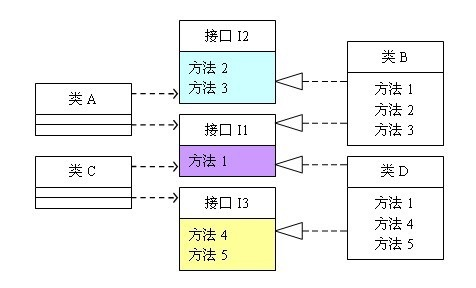
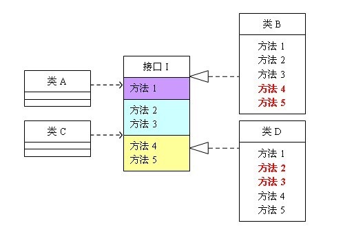

## 接口隔离原则 

### 定义 

> 客户端不应该依赖它不需要的接口；一个类对另一个类的依赖应该建立在最小的接口上。 

### 例证 

接口隔离原则是为了避免接口中所包含的方法过于庞大，从而导致系统灵活性、维护性降低。为了说明这个原则我引入了一张网络图片： 

在实际项目中我们经常能找到图中这样的需求，类A和类C会依赖接口I的实现，这里我们假设类A需要接口I中方法1、2、3，其依赖实现是类B，而类C依赖接口I中的方法1、4、5，其依赖实现是类D，如果项目中存在大量类似类A或类C这样的对I接口的依赖的话，我们则可以将接口I中的方法做一划分，如上图所示，这里我们就可以将这个接口拆分成三个独立的接口，如下图所示。 

除了如上图所示的拆分，我们可以一个方法一个接口，但是如果这样设计的话，那么就会导致另外一个问题了，过度细化的接口设计会真大系统的复杂度，虽然灵活性有了，但是可读性会变差，同时这也加大了方法的调用难度。 

### 感悟 

通过上面两张图我们简单的了解了什么是接口隔离原则，也明白了如何利用该原理来设计接口。这个原则其实是需要我们掌握接口设计的一个度，太细会使可读性和使用性变差，过粗又会影响灵活性，所以根据项目实际的业务合理的设计才是最好的设计。 